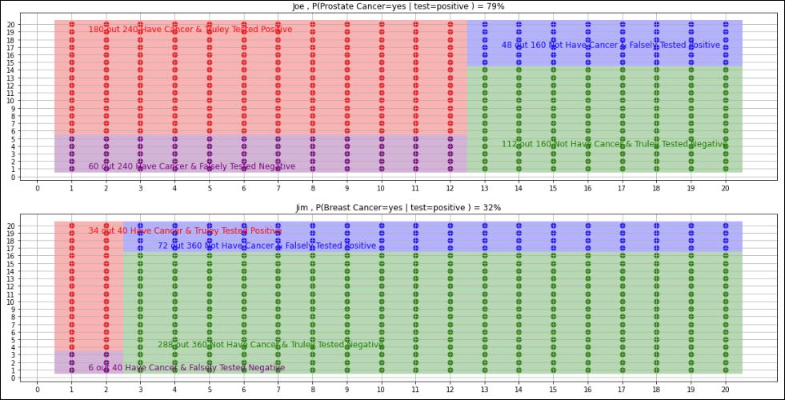

  

# Bayesian Medical Testing Analysis & Visualizaion
From Majid Feiz, Bayesian-Inference-Application in Medical Testing

Bayesian inference is a method of statistical inference in which Bayes' rule is used to update the probability for a hypothesis as more evidence or information becomes available. In clinical medicine Bayesian methods are used to establish the probability that a patient has a particular condition given the results of the test used and the prevalence of the condition in the population tested.
In this analysis, consider two people, Joe and Jim, who went to cancer screening at different clinics, Joe for prostate 
cancer screening and Jim for breast cancer screening. Male breast cancer is rare (“less than 1% of all 
breast cancers occur in men”, https://www.breastcancer.org/symptoms/types/male_bc), but prostate 
cancer is common (“About 6 cases in 10 are diagnosed in men who are 65 or older”, 
https://www.cancer.org/cancer/prostate-cancer/about/key-statistics.html). Both heard that their cancer
screenings turned out positive. In this exercise, assumed P (Cancer=Male_breast) = 0.01 and P
(Cancer=Male_prostate) = 0.6. Also assumed sensitivity (TPR) and specificity (TNR) for prostate cancer screening are 0.75 and 
0.70 and TPR and TNR for breast cancer screening are 0.85 and 0.80, respectively.\
The project's goal is to develop a contingency table for Bayesian inferencing for each individual to see which one is more likely to have cancer and provide bayes frequency box visualization plot.

**Project Status: Completed**
 
<a href="https://github.com/majfeizatgmaildotcom/Medical-Testing-Analysis-Visualization/blob/1e0957e56c8ee7c9c745235e94fe76e240ce7e96/Medical_Testing_Analysis_Visualization.ipynb">Jupyter Notebook Viewer</a>

## Results

Considering the sensitivity and specificity of the cancer test, we could use the Bayesian theory to calculate the likelihood of having cancer and have a positive test among all positive test populations. In the figure above, the total area of red and blue is the population of people who tested positive. Red zone belong to the people who have cancer and truly tested positive prediction (subjected to the test's sensitivity). As seen in the figure, the red area is larger in Joe (with prostate cancer) comparing to Jim ( with breast cancer); thus, with all uncertainty of the test cancer consideration, it is more likely that Joe has Prostate cancer (with ~79% probability) and it is less likely (with ~32%) that Jim would have a breast cancer.
